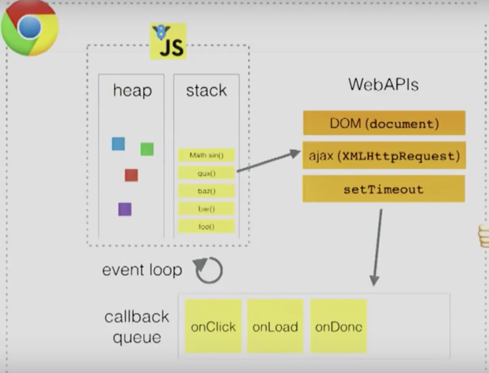

# Objects in Javscript


## Bind
### How the THIS keyword works with Object Literals and BIND

``` js
let dog = {
  sound: 'woof',
  talk() {
    console.log(this.sound);
    //here we have a property sound with the value woof
    // and the talk method using the this keyword to brings out the sound property to the console
  }
};

dog.talk();

//Observation
//we took the dog.talk method and we assigned it to a variable and then we called that variable and that returned undefined

let talkFunction = dog.talk;

//reassigning a method to a variable like this, it is now long longer a method it is just a function it has kind of ceased to be a method connected to an object its now just a free flowing function

talkFunction();
//so when you call it here "this" is no longer going to be the dog , it has lots its conenction to the dog object

/**
 * In a function, the THIS keyword does not refer to the context where the function was defined, it refers to the context where the function is being called 
 * 
 * We can bind it to that context by using the function "bind"
 *
 */

let boundFunction = talkFunction.bind(dog);

boundFunction();

/**
 * The bind function here is going to take the talkFunction and its going to return a new function here that has bound dog to the THIS keyword. so BIND forces "THIS" to be dog.  
 */

 let button = document.getElementById('myNiceButton');

 button.addEventListener(
   'click',
   dog.talk
 )

 /**
  * Here we assign the talk method to the click handler of the button but when the click handler is being called THIS is not going to be the dog its going to be the window object becaues that is where the add event listneer are being triggered 
  * 
  * There fore people will solve this by binding dog.talk with dogtalk.bind(dog)
  */

 /**
  * Here we assign the talk method to the click handler of the button but when the click handler is being called THIS is not going to be the dog its going to be the window object becaues that is where the add event listneer are being triggered 
  * 
  * There fore people will solve this by binding dog.talk with dogtalk.bind(dog)
  */

  /**
   * Side note, addEventListenr listen to the click event, and when that event is triggered, it runs the dog.talk.bind(dog) fucntion
   * 
   */
```

## How JS Actually Works
* JS is a single threaded non blocking asynchronous concurrent runtime
* JS has a call stack, an event loop, a callback queue, and some other apis and stuff



# The Engine
* `Heap` is the memory allocation and mangament 
* `Callstack` is inside of v8
  - One thread == one call stack == one thing at a time
  - Callstack is how JS runtime figures out what function is JS currently workign through and when the function is finished where the function returns to   
  - The deepest function is at the bottom, and the most recent function that generates the current error is at the top of the call stack

# Concurrency & the Event Loop
* Everytime there is a async code, JS push the task from stack to the webapi (by firing a thread), and put the rest of the code on the stack
* When the async code is finished from the webapi, and puts its callback in the task queue / call back queue
* Event loop: push the call back of that async code in the task queue onto the stack if the stack is cleared
* The call back is then executed and get cleared
* For the DOMS, the DOM stay in the webapi and whenever the dom event is triggered it pushes its callback into the taskqueue (they cant do two things at once, so this is gonna cause a race condition)

# Promise review
* The promise object is used for `deferred` and asynchronous computations
* JS's thread ensure javscript runs synchronously (things run in a single line)
* Promise can only settle once
* Promise execute in the main thread (but still in web api. but can potentially blocking)
* Promise decides what will happen when an asynchronous task settles

``` js
new Promise( (resolve, reject) => {
  let img = documnet.createElement('img');
  img.src = 'image.jpg';
  img.onload =  ;
  img.onerror = reject;
  document.body.appendChild(img);
})
.then(finishLoading)
.catch(showAlternate Image)

```
1) In this Example, the promise either resolve or reject base on whether or not the image onLoad or onError
2) The promise is resolved, but it isnt fulfilled / settled just yet, because it still has some left over code to execute after it has resolved or rejected
3) it then executes another line of code documnet.body.appendChild
4) then when that code finshes, the promise has officially fulfilled / settlted
5) and the THEN gets triggerd, because then only gets triggered when a prommise is fulfilled / setttled
6) Being able to call resolve and reject allows you to define what consitutes reject and resolve in your promise
7) The value passed into resolve and reject is the value THEN and CATCH receives once a promise fulfills
8) If a promised P is passed to resolve, P gets executes FIRST and the resolved value of P will be passed to the next then
9) As soon as a promise rejects, JS skips to the .catch in the chain, that means you just need one .catch to catch all promise errors 


## JS Best Practices
``` js
//put obj short hand notation first 
const anakinSkywalker = 'Anakin Skywalker';
const lukeSkywalker = 'Luke Skywalker';

const obj = {
  anakinSkywalker,
  lukeSkywalker,
  ep: 1,
  season: 2
}

//use method shorthand
const obj2 = {
  addvalue(value) {
    return value + 1;
  }
}

//use computed property names when creating objects with dynamic property name

getKey(k) => {
  return `a key name ${k}`;
}

const obj = {
  id: 5,
  name: 'San Francisco',
  [getKey('myKey')]: true
  //square bracket notation because its gonna be a string
  //this allows you to generate dynamic property key name
}

//only quote properties that are invalid identifier
const good = {
  foo: 3,
  bar: 4,
  'date-blah': 5
}

//use push instead of direct assignment
const someStack = [];
someStack[someStack.length] = 'abc' //bad
someStack.push(abc) //good

//use array spreads ... to copy arrays
const itemsCopy = [...items]

```
### JS Things
``` js 
let a = [1,2,3,4,5];
console.log(...a) //print 1 , 2, 3, ,4, 5

let obj = {a: 1, b: 2};
console.log({...obj, c:3}) //{a: 1, b: 2, c:3}

//array descturcting
const arr = [1, 2, 3, 4];
const [a,b,c,d] = arr;
a = 1, b = 2, c = 3, d = 4
const [first, second] = arr; 
first = 1, second = 2

//object desctructing
processInput(input) => {
  return {left, right, top, bottom};
}

//the caller selects only the data they need
const {left, top} = processInput(input);

```
> Read Open Source Code to learn best practices 

