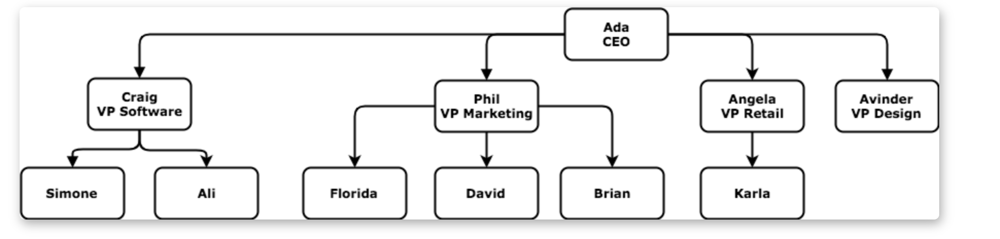

# Data Structures
* Programming reloves around `data` and we write `software` to `retrieve`, `modify`, and `display` data
* `Array`
  - **Pros:** when we have a `list` of data especially when that list is `in some order`
* `Objects`
- **Pros:** when we want to be able to look up data quickly using a key

# Tree 
* Compsoed of `individual` key entities and their `relationships` with `other` key entities
* The `relationships` **between different key entities** `sets` tree apart

# Tree Structure
* Each `key entity` is a tree is called `node`
* A `node` represents a `key entity` and **`contains data`** `about that entity`
* All the `connections` **between** the `nodes` are called `edges`
* `Trees` are a great `data` `structure` to use when your `data` has `hierarchical relationships`
* Trees `allows` us to `use` these `relationships` in code making the `data easier to process`

**We can build a tree out of anything as long as the nodes have a single parent and many childern:**

**Node** |
---
parent |
childern |
data |

**In our example, our structure is **

**Node** | **Employee**
---------|-------------
parent | boss
childern | subordinates
data | name, title, slary

**Other Examples**
1) The Browser's Dom

**Node** | **HTMLElement**
---------|-------------
parent | Parent Element
childern | Child Element
data | Attributes (id, class, etc)


## Example


* In this example:
  1) Each `node` represents an `employee`
  2) And the `data` contains their `name`

## Back to Tree Structure
* The node at the very `top` of the tree is called `root node`
* The nodes on the very `bottom` are called `leaf nodes`
* Every node (**except for the root**) has a `single parent node`
* Every node that `isnt leaf` node has `1 or more childern nodes`
* `Childern` with the `same parent` are `sibilings`

## Working with Tree Structure
* Make sure you set **both** `PARENTS` and `CHILD`
* since tree uses relationship to access data, and relationship is almost always two ways, you have to think both ways when you are working with trees

## Tree Traversal

### Breath First Traversal
* Breath first traversal will check the nodes `closest` to the `root` node, `before` checking the `nodes` that are `farther` `away`
* BF checks each rows of the tree
1) Start with the root node
2) Move onto the root's childern
3) Move onto those node's childern

### Depth First Traversal
* DF always be trying to visit the leaf nodes
* DF will visit each node on an entire path, all the way out to a leaf node, before visiting nodes on the next path
* If after exahusting a path and it still cant find the element, it will thehn go to the sibilings or cousins if it has any

### Implementation of BFT or DFT
* A tree is a recursive data structure
* Tree is made up of smaller sub trees, which themselves are made up of even smaller sub tress
* Every node in the tree (except from the root node) is the root node of a smaller tree
* The leaf node is a root node of a tree with 0 childern

### Traversal for DFS 
1) Visit the root node of the tree
2) Get the first unvisited child sub-tree of the current node
3) Do step 1 with the subtree

**Pseudo**
Traverse tree:

  visit the root node of the tree
  let subTree = the first unvisited child sub-tree of the root node

  Recursive Case:
    If there is a subTree, traverse subTree
  Base Case:
    If there is no subTree, do nothing


### JS Things

### Rest Parmaeters
* when you write a function, if you put (...args) as the params, then you gonna turn the input data into an array
* Rest Params have to be at the last argument because it collects all `remaining`arguments into an array

### Spread Operator
* Use when adding array elements into an exisitng array
* Or copying array
* So its more used when you pass it into an function?
``` js
const arr = ["Joy", "Wangari", "Warugu"];
const newArr = ["joykare", ...arr];
const arr = [1,2,3];
const arr2 = [...arr]
```

### Object.entries()
``` js
const obj = { foo: 'bar', baz: 42 };
console.log(Object.entries(obj)); // [ ['foo', 'bar'], ['baz', 42] ]
```

### While loop Vs Recursion in terms of memory use
* recursion adds the recursively called function on the stack everytime it is called
* while loop changes the same memory frame
* so in the example of todays code, the while loop is more memory efficient 

### Writing Code Things
1) Always aim for `simplicity` rather than `cleverness`
2) Code should be easy to understand 
3) Code should be easy to use
4) Code should be easy to change and update (updating or changing shouldn't break everything)
5) After you done something over and over again, then you can think about refactoring it 
6) Aiming for cleverness at first might resulting in unexpected behaviours, which might have you debugging your own code after not working on it for a while

# Test Strctures
* Strcuture your test this way:

```
test
├── 1_addOffspring.js
├── 2_numberOfOffspring.js
├── 3_numberOfVampiresFromOriginal.js
├── 4_moreSeniorVampire.js
└── 5_closestCommonAncestor.js
```
* Then when you run npm test, you could do
  - npm test --test/1*.js
  - npm test --test/2*.js
  to test out specific functions 